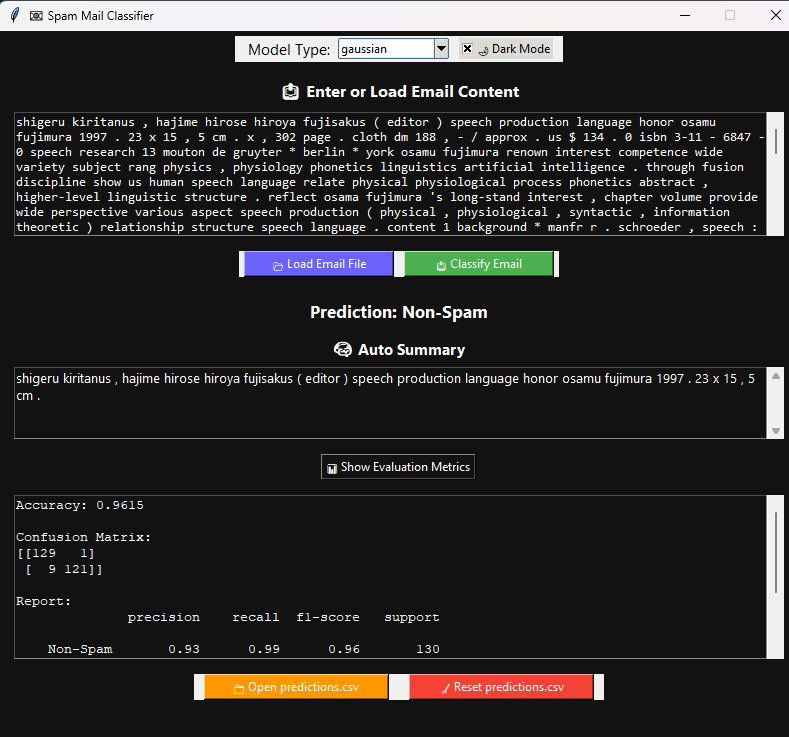

# 📧 Spam Mail Classifier using Naive Bayes

<p align="center">
  
</p>


***

## 📜 Table of Contents

```text
1. Overview
2. Features
3. Dataset
4. Installation
5. Usage
6. Project Structure
7. GUI Overview
8. Model Details
9. Evaluation Metrics
10. License
11. Acknowledgements
12. Author & Contact
```


***

## 1. 📌 Overview

This project is a **Spam Email Detection** tool powered by the **Naive Bayes classification algorithm**.
It allows you to:

- Train the model on a dataset of labeled spam \& non-spam emails
- Test \& evaluate accuracy
- Classify new emails using a clean Tkinter **GUI**
- View and reset **predictions.csv** history
- Auto-generate summaries of classified emails

The classifier supports:

- **GaussianNB**
- **MultinomialNB**
- **BernoulliNB**

***

## 2. 🚀 Features

- 📂 **Load emails from file** or **paste text** directly
- 🧠 Multiple Naive Bayes variants
- 📊 Accuracy, confusion matrix \& classification report
- 🌙 Dark Mode
- 📝 Auto-summary of email content
- 💾 Save predictions to **CSV** for record-keeping

***

## 3. 📂 Dataset

The dataset consists of:

- `702` training emails (50% spam, 50% non-spam)
- `260` testing emails
Each email's:
- **First line** → Subject
- **Content starts from third line**

***

## 4. ⚙ Installation

```bash
# Clone the repository
git clone https://github.com/ShyamSanjeyS/Naive-Bayes-Spam-Mail-Detector.git
cd Naive-Bayes-Spam-Mail-Detector

# Install dependencies
pip install numpy scikit-learn nltk
```

> **Note:**
> Run the following NLTK setup command before using the summarizer:

```python
import nltk
nltk.download('punkt')
```


***

## 5. ▶ Usage

Run the GUI application:

```bash
python app.py
```

**Steps inside GUI:**

1. Select model type (`Gaussian`, `Multinomial`, `Bernoulli`)
2. Paste or load email text
3. Click **"Classify Email"**
4. View **Prediction** \& **Summary**
5. Optional: View **Evaluation Metrics**, open/reset CSV

***

## 6. 🗂 Project Structure

```text
Spam-Mail-Classifier/
│
├── app.py                # Main Tkinter GUI
├── spam_classifier.py    # Naive Bayes Classification Logic
├── predictions.csv       # Saved predictions
├── Data/
│   ├── train-mails/      # Training dataset
│   └── test-mails/       # Testing dataset
└── README.md             # Project Documentation
```


***

## 7. 💻 GUI Overview

The main interface and user workflow of the application:

- **Model Selection Dropdown**
- **Dark Mode Switch**
- **Text area** (email content)
- **"Classify Email"** button
- **Prediction display**
- **Summary area**
- **Metrics viewer**
- **CSV management buttons**


### 📸 GUI Screenshot

Below is a real screenshot of the application in action:


***

## 8. 📊 Model Details

Implemented models:

- **GaussianNB**: Works with continuous features
- **MultinomialNB**: Best for discrete counts
- **BernoulliNB**: Good for binary/boolean features

***

## 9. 📈 Evaluation Metrics

After training/testing:

- ✅ Accuracy
- 📉 Confusion Matrix
- 📑 Classification Report

Example output:

```text
Accuracy: 0.9538

Confusion Matrix:
[[124   3]
 [  9 124]]

Report:
              precision    recall  f1-score   support

    Non-Spam       0.93      0.98      0.96       127
        Spam       0.98      0.93      0.96       133

    accuracy                           0.95       260
   macro avg       0.96      0.95      0.95       260
weighted avg       0.96      0.95      0.95       260
```


***

## 10. 📄 License

This project is licensed under the **MIT License**.[License](LICENSE)

***

## 11. 🙌 Acknowledgements

- Dataset \& template: **Arin Brahma**
- GUI \& Enhancements: Custom implementation

***

## 12. 👤 Author \& Contact

**shyamsanjey**
🔗 [LinkedIn](www.linkedin.com/in/shyamsanjey2004)
🔗 [GitHub](https://github.com/ShyamSanjeyS)
✉️ shyamsanjey.s@gmail.com

For suggestions or feature requests, write to: `shyamsanjey.s@gmail.com`

***

<div style="text-align: center">⁂</div>

[^1]: app.py

[^2]: predictions.csv

[^3]: README.md

[^4]: spam_classifier.py

[^5]: gui.jpg

